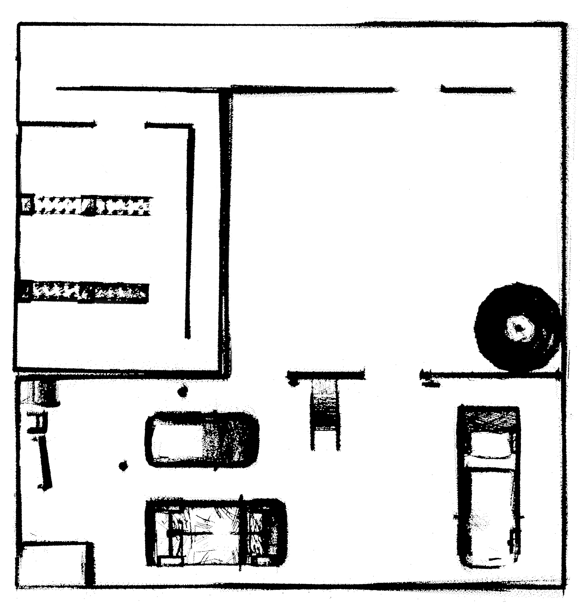
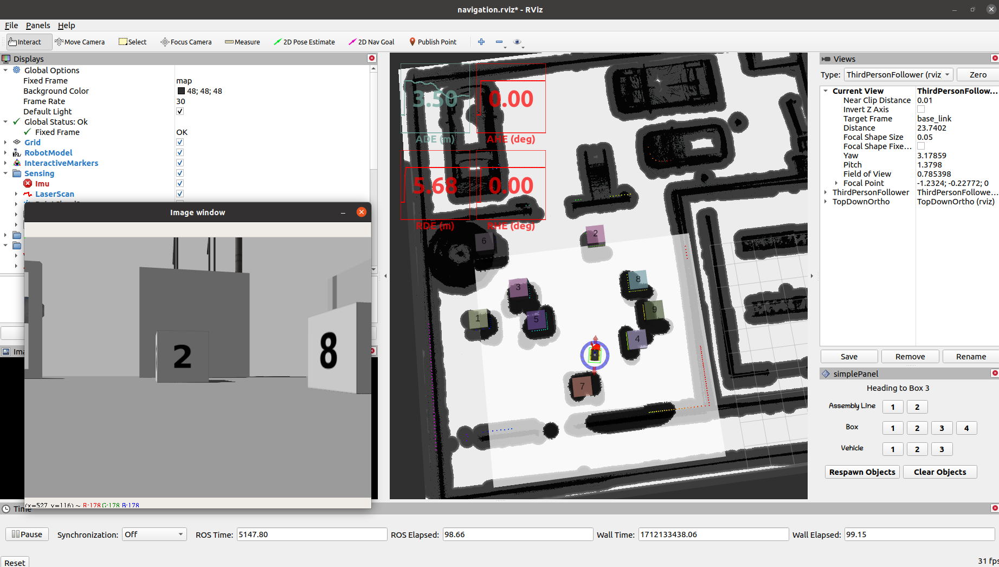

# Autonomous Vehicle SLAM, Perception, and Navigation
COPYRIGHT VIOLATION NOTICE: We have found that many of our classmates have viewed our project. In the spirit of open source, we have not set our project as private. However, please do not directly copy from our code, we have a full submission record, showing that we have build our project completly by ourselves. Any plagiarism will be considered a breach of the NUS Academic Integrity Regulations.

This project is based on the NUS ME5413 Autonomous Mobile Robotics Final Project. We are the group 14.
> Authors: [Tony](https://github.com/ztony0712), [Biao](https://github.com/legubiao), [David](https://github.com/huangyqs123), [Chen](https://github.com/Chronobreakk), and [Bob](https://github.com/elegant1234)
<!-- > Video Presentation -->
[](https://www.youtube.com/watch?v=WiEzSJmcEQE)

As you see in the video, we have implemented the following techniques:
- For SLAM: The Fast-lio algorithm is chosen for 3D LiDAR SLAM 
- For Localization: The AMCL algorithm is chosen for localization
- For Navigation: The MoveBase tool is used, we implement a global planner (A*) and a local planner (Time Elastic Band, TEB). Furthermore, the obstacle inflation is configured to avoid collision.
- For Perception: The simple template match from OpenCV is used to detect the target box in the simulation environment. A Kinect camera is deployed to substitute the monocular camera so that the depth information can be obtained.

For more detail information, please check our report pdf file.

## Dependencies
* SLAM requirements (Don't need to install if you don't want to repeat the SLAM process):
  * [Fast-lio](https://github.com/hku-mars/FAST_LIO)
  * [Cartographer](https://google-cartographer-ros.readthedocs.io/en/latest/)
* Navigation requirements:
  * [Navigation package (containing move_base, amcl, teb_local_planner)](https://github.com/ros-planning/navigation)
* Perception requirements:
  * [OpenCV (Only 4.2.0 is tested)](https://opencv.org/blog/opencv-4-2-0/)

## Installation

This repo is a ros workspace, containing three rospkgs:
* `costmap_prohibition_layer-kinetic-devel` are tools to add a prohibition layer to the costmap
* `interactive_tools` are customized tools to interact with gazebo and your robot
* `jackal_description` contains the modified jackal robot model descriptions
* `me5413_world` the main pkg containing the gazebo world, and the launch files

Clone this repo to your root directory:
```bash
# Clone and go to the directory
cd
git clone https://github.com/huangyqs123/ME5413_Final_Project
cd ME5413_Final_Project

# Install some dependencies
rosdep install --from-paths src --ignore-src -r -y

# Build
catkin_make
# Source (it is recommended to add this line to your ~/.bashrc)
source devel/setup.bash
```

To properly load the gazebo world, you will need to have the necessary model files in the `~/.gazebo/models/` directory.

* [TA's customized models](https://github.com/NUS-Advanced-Robotics-Centre/ME5413_Final_Project/tree/main/src/me5413_world/models)

```bash
# Copy the customized models into the `~/.gazebo/models` directory
cp -r ~/ME5413_Final_Project/src/me5413_world/models/* ~/.gazebo/models
```

Install the required packages of navigation and perception:
```bash
# Install the navigation package (for move_base, amcl)
sudo apt-get install ros-noetic-navigation

# Install the teb local planner
sudo apt-get install ros-noetic-teb-local-planner

# If rviz can't display the input image from camera, install the compressed-image-transport
sudo apt-get install ros-noetic-compressed-image-transport

# Install vision_msgs
sudo apt-get install ros-noetic-vision-msgs
```

## Usage

### 0. Gazebo World

This command will launch the gazebo with the project world

```bash
# Launch Gazebo World together with our robot
roslaunch me5413_world world.launch
```

### 1. Mapping
**Note**: If you use the existing map, you can skip this step. This is only for testing the SLAM process.

After launching **Step 0**, in the second terminal:

```bash
# Launch GMapping
roslaunch me5413_world mapping.launch

# or launch Cartographer 2D
roslaunch me5413_world cartographer_2d.launch

# or launch Cartographer 3D
roslaunch me5413_world cartographer_3d.launch

# or launch Fast-lio
roslaunch me5413_world fast_lio.launch
```

After finishing GMapping and Cartographer mapping, run the following command in the thrid terminal to save the map:

```bash
# Save the map as `my_map` in the `maps/` folder
roscd me5413_world/maps/
rosrun map_server map_saver -f my_map map:=/map
```

However, the Fast-lio algorithm will save the map automatically. The following map is generated by Fast-lio, which performs best comparing to other SLAM algorithms:



### 2. Whole Navigation Process
In the first terminal:
```bash
# Launch Gazebo World together with our robot
roslaunch me5413_world world.launch
```

In the second terminal:
```bash
# Load a map and launch AMCL localizer
roslaunch me5413_world navigation.launch
```

There will be a detection visualization window pop up, which shows the green roi area when target is found. If you can't see the window, please check the terminal output to see if the detection scripts are working. In general, giving permissions to the three Python scripts in scripts folder solves this problem.

```bash
# Give permision to the scripts
cd ~/ME5413_Final_Project/src/me5413_world/scripts
chmod +x detector.py
chmod +x roi_coordinate_calculator.py
chmod +x viz.py
```



# The following part is the original README.md from the TA's repo

# ME5413_Final_Project

NUS ME5413 Autonomous Mobile Robotics Final Project
> Authors: [Christina](https://github.com/ldaowen), [Yuhang](https://github.com/yuhang1008), [Dongen](https://github.com/nuslde), and [Shuo](https://github.com/SS47816)


## Dependencies

* System Requirements:
  * Ubuntu 20.04 (18.04 not yet tested)
  * ROS Noetic (Melodic not yet tested)
  * C++11 and above
  * CMake: 3.0.2 and above
* This repo depends on the following standard ROS pkgs:
  * `roscpp`
  * `rospy`
  * `rviz`
  * `std_msgs`
  * `nav_msgs`
  * `geometry_msgs`
  * `visualization_msgs`
  * `tf2`
  * `tf2_ros`
  * `tf2_geometry_msgs`
  * `pluginlib`
  * `map_server`
  * `gazebo_ros`
  * `jsk_rviz_plugins`
  * `jackal_gazebo`
  * `jackal_navigation`
  * `velodyne_simulator`
  * `teleop_twist_keyboard`
* And this [gazebo_model](https://github.com/osrf/gazebo_models) repositiory

## Installation

This repo is a ros workspace, containing three rospkgs:

* `interactive_tools` are customized tools to interact with gazebo and your robot
* `jackal_description` contains the modified jackal robot model descriptions
* `me5413_world` the main pkg containing the gazebo world, and the launch files

**Note:** If you are working on this project, it is encouraged to fork this repository and work on your own fork!

After forking this repo to your own github:

```bash
# Clone your own fork of this repo (assuming home here `~/`)
cd
git clone https://github.com/<YOUR_GITHUB_USERNAME>/ME5413_Final_Project.git
cd ME5413_Final_Project

# Install all dependencies
rosdep install --from-paths src --ignore-src -r -y

# Build
catkin_make
# Source 
source devel/setup.bash
```

To properly load the gazebo world, you will need to have the necessary model files in the `~/.gazebo/models/` directory.

There are two sources of models needed:

* [Gazebo official models](https://github.com/osrf/gazebo_models)
  
  ```bash
  # Create the destination directory
  cd
  mkdir -p .gazebo/models

  # Clone the official gazebo models repo (assuming home here `~/`)
  git clone https://github.com/osrf/gazebo_models.git

  # Copy the models into the `~/.gazebo/models` directory
  cp -r ~/gazebo_models/* ~/.gazebo/models
  ```

* [Our customized models](https://github.com/NUS-Advanced-Robotics-Centre/ME5413_Final_Project/tree/main/src/me5413_world/models)

  ```bash
  # Copy the customized models into the `~/.gazebo/models` directory
  cp -r ~/ME5413_Final_Project/src/me5413_world/models/* ~/.gazebo/models
  ```

## Usage

### 0. Gazebo World

This command will launch the gazebo with the project world

```bash
# Launch Gazebo World together with our robot
roslaunch me5413_world world.launch
```

### 1. Manual Control

If you wish to explore the gazebo world a bit, we provide you a way to manually control the robot around:

```bash
# Only launch the robot keyboard teleop control
roslaunch me5413_world manual.launch
```

**Note:** This robot keyboard teleop control is also included in all other launch files, so you don't need to launch this when you do mapping or navigation.


### 2. Mapping

After launching **Step 0**, in the second terminal:

```bash
# Launch GMapping
roslaunch me5413_world mapping.launch
```

After finishing mapping, run the following command in the thrid terminal to save the map:

```bash
# Save the map as `my_map` in the `maps/` folder
roscd me5413_world/maps/
rosrun map_server map_saver -f my_map map:=/map
```


### 3. Navigation

Once completed **Step 2** mapping and saved your map, quit the mapping process.

Then, in the second terminal:

```bash
# Load a map and launch AMCL localizer
roslaunch me5413_world navigation.launch
```


## Student Tasks

### 1. Map the environment

* You may use any SLAM algorithm you like, any type:
  * 2D LiDAR
  * 3D LiDAR
  * Vision
  * Multi-sensor
* Verify your SLAM accuracy by comparing your odometry with the published `/gazebo/ground_truth/state` topic (`nav_msgs::Odometry`), which contains the gournd truth odometry of the robot.
* You may want to use tools like [EVO](https://github.com/MichaelGrupp/evo) to quantitatively evaluate the performance of your SLAM algorithm.

### 2. Using your own map, navigate your robot

* From the starting point, move to the given pose within each area in sequence
  * Assembly Line 1, 2
  * Random Box 1, 2, 3, 4
  * Delivery Vehicle 1, 2, 3
* We have provided you a GUI in RVIZ that allows you to click and publish these given goal poses to the `/move_base_simple/goal` topic:
  
  

* We also provides you four topics (and visualized in RVIZ) that computes the real-time pose error between your robot and the selelcted goal pose:
  * `/me5413_world/absolute/heading_error` (in degrees, wrt `world` frame, `std_msgs::Float32`)
  * `/me5413_world/absolute/position_error` (in meters, wrt `world` frame, `std_msgs::Float32`)
  * `/me5413_world/relative/heading_error` (in degrees, wrt `map` frame, `std_msgs::Float32`)
  * `/me5413_world/relative/position_error` (in meters wrt `map` frame, `std_msgs::Float32`)

## Contribution

You are welcome contributing to this repo by opening a pull-request

We are following:

* [Google C++ Style Guide](https://google.github.io/styleguide/cppguide.html),
* [C++ Core Guidelines](https://isocpp.github.io/CppCoreGuidelines/CppCoreGuidelines#main),
* [ROS C++ Style Guide](http://wiki.ros.org/CppStyleGuide)

## License

The [ME5413_Final_Project](https://github.com/NUS-Advanced-Robotics-Centre/ME5413_Final_Project) is released under the [MIT License](https://github.com/NUS-Advanced-Robotics-Centre/ME5413_Final_Project/blob/main/LICENSE)
